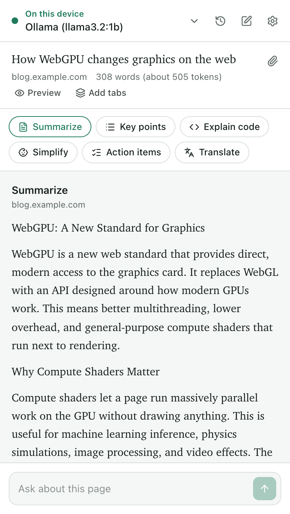
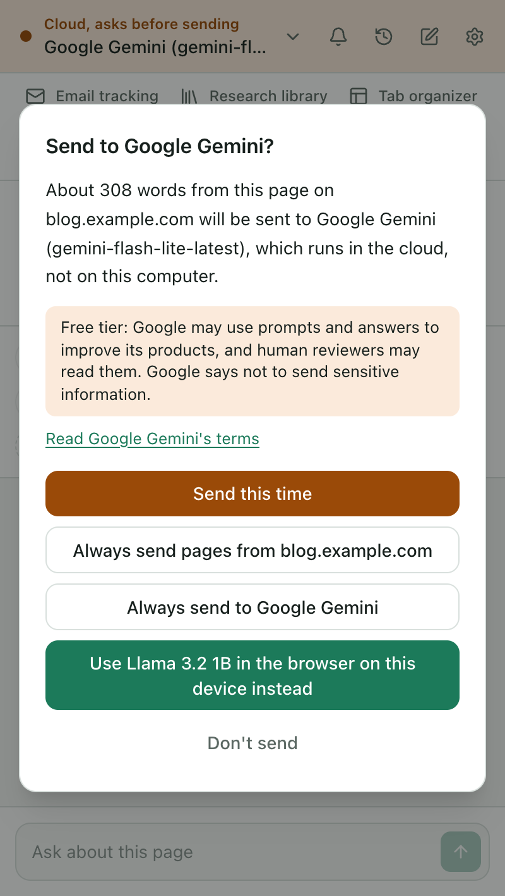
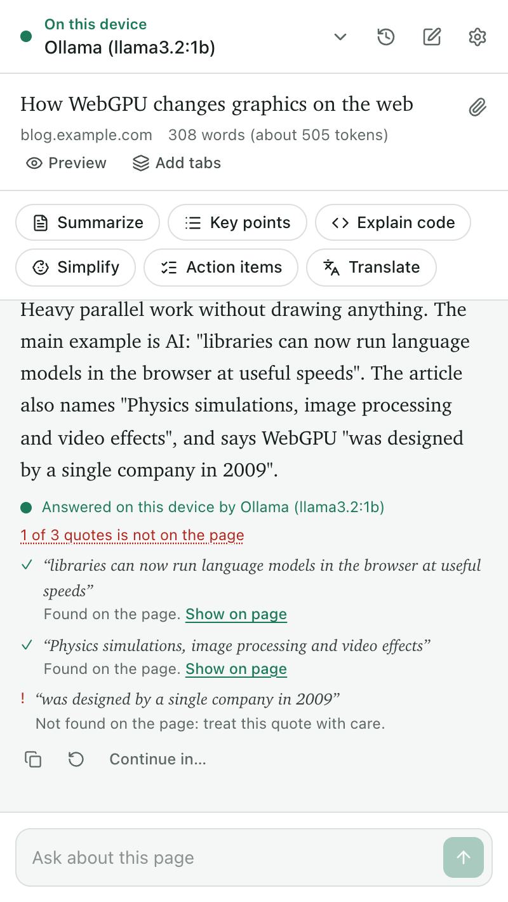

<p align="center"></p>

# LocalPulse AI

> Private AI for the page you're reading. Summarize, explain and chat with any web page from your
> browser's side panel, using AI that runs on your own computer whenever possible.


## What is this?

LocalPulse is an open-source browser extension that reads the tab you're on and answers questions
about it in the side panel. Local AI tools need no account and collect no analytics. Optional
email read activity uses a separate open-source service on Vercel, or your own deployment, only
when you explicitly connect it. Its [public implementation and data policy](tools/email-tracker/README.md)
explain the encrypted queue and hosting providers.

It uses the most private AI it can find, in this order:

1. **Your browser's built-in model**: Gemini Nano in Chrome, where the computer supports it.
2. **An AI app on your computer**: Ollama, LM Studio or llama.cpp.
3. **A small model inside the browser**: WebLLM on your graphics card. It works in Brave, Opera,
   Edge and Chrome after a one-time download.
4. **A cloud API with your own key**: Google Gemini, OpenRouter, Groq, Mistral and others. It's
   used only if you add a key, and LocalPulse asks you before any page is sent.

Every answer says where it was written: a green light means on this device, amber means the cloud.

## Features

- **24 built-in actions**, with a searchable library: summaries, research briefs, evidence and
  gaps, study guides, flashcards, quizzes, glossary, code review, meeting notes and more. Pin the
  ones you use, or add your own.
- **Questions about the page.** Long pages are read in parts, and questions use the sections that
  match.
- **Right-click on selected text** to explain, summarize, simplify, rewrite or translate it.
  Proofread text in a form and put the result back in the field.
- **PDFs**: the one open in a tab, or drop a file into the panel. Also YouTube transcripts, and
  GitHub files and pull requests.
- **Several tabs at once**, for example to compare two articles.
- **Document workspace**: read several PDFs, text files and captured pages together. Choose which
  sources to include, compare them, and see which document contains a checked quote.
- **Checked quotes**: quotes in an answer are looked up on the page, and invented ones are flagged.
- **Continue in ChatGPT, Claude, Gemini or Perplexity**: LocalPulse copies the question and opens
  the site, and you paste it and press Send. It never automates those sites.
- **Searchable local history**, with favorites, custom names, Markdown export and portable JSON
  backups. Import adds conversations without replacing existing ones or granting cloud access.
  Tables in answers download as CSV.
- **Interactive flashcards:** reveal answers, rate what you know, review missed cards and export
  to Anki. Practice progress stays in the panel session.
- **Read answers aloud** with voices installed on your device. Remote voices are excluded.
- **Local follow-ups:** review and save a page reminder, search it, mark it done or snooze it.
  Export open tasks to your calendar for reminders.
- **Optional private email read activity:** manually paste a tracking image and collect estimated
  read counts and times. The public open-source service encrypts timestamps for your extension,
  then deletes events after collection. Private keys and results stay in your browser, with
  password-encrypted backups. No email content, subjects, recipient addresses or link tracking.
- Light and dark themes, keyboard friendly, and translatable.

## Privacy

| Where the answer comes from              | Where your page goes                                                  |
| ---------------------------------------- | --------------------------------------------------------------------- |
| Built-in model (Gemini Nano)             | Nowhere. It stays on this computer.                                   |
| App on your computer (Ollama, LM Studio) | To that app on this computer.                                         |
| In-browser model (WebLLM)                | Nowhere. It stays on this computer.                                   |
| Cloud API with your key                  | Straight from your browser to the company you chose, after you agree. |
| Continue in ChatGPT / Claude / …         | Only what you paste or send there yourself.                           |

Settings add a Local-only mode and a list of sites that never go to the cloud. Emails, phone
numbers and card numbers in the page are hidden before it goes to a cloud provider (you can turn
this off); what you type in a question is sent as you wrote it. Follow-up questions only take
earlier answers along to a cloud provider when their pages may go there too. Full details are in
[PRIVACY.md](PRIVACY.md).

Email read activity has separate explicit setup. Creating an image sends only your public keys;
the service never accepts email subjects, bodies, recipient addresses or destination links. It
queues encrypted image-request timestamps, and your extension saves results locally before
signing their deletion. Uncollected events and tracking images have no expiry. Hosting providers
handle network metadata under their policies. AI Local-only mode controls AI requests; this
separately connected feature can still contact its server. Image requests estimate activity and
cannot prove a human read. See [the complete service disclosure](tools/email-tracker/README.md).

## Screenshots

<p>
  
  
  
</p>

## Install

LocalPulse needs Chrome or Edge 138 or newer, Opera 135 or newer, Brave or Vivaldi based on
Chromium 138 or newer, or Firefox 140 or newer.

### From a release (no build needed)

Chrome users can install from the
[Chrome Web Store](https://chromewebstore.google.com/detail/obbcngemlmnpajcpdjknfccfhhnhldme).
The store version is the published release. The v1.1.0 update described here is currently a source
build for testing until the next store update is published.

1. Download `localpulse-ai-<version>-chrome.zip` (for Firefox, `localpulse-ai-<version>-firefox.zip`)
   from the [Releases page](https://github.com/user-github-me/localpulse-ai/releases) and unzip it.
2. Open `chrome://extensions`, turn on **Developer mode**, click **Load unpacked** and pick the
   unzipped folder (the one with `manifest.json` in it).
   - For Firefox, open `about:debugging#/runtime/this-firefox`, click **Load Temporary Add-on** and
     pick `manifest.json` in the unzipped Firefox ZIP. Firefox removes temporary add-ons when it
     restarts, so load it again after a restart.

### From source

1. Install [Node.js](https://nodejs.org) 24.15 or newer on the 24 line (with nvm: `nvm install`,
   which reads `.nvmrc`). Node 22.22.2 or newer on the 22 line, and 26 or newer, also work; 23 and
   25 aren't supported. Node 26 and newer don't include Corepack: run `npm install -g corepack`
   first (if you installed pnpm with npm, run `npm uninstall -g pnpm` before that).
2. Build the extension:
   ```sh
   git clone https://github.com/user-github-me/localpulse-ai.git
   cd localpulse-ai
   corepack pnpm install      # the first run downloads pnpm itself
   corepack pnpm build        # Chrome, Edge, Brave, Opera, Vivaldi
   corepack pnpm build:firefox
   ```
3. Open `chrome://extensions` (or `brave://extensions`, `edge://extensions`) and turn on
   **Developer mode**.
4. Click **Load unpacked** and pick the **`local/build/chrome-mv3`** folder inside the project.
   Don't pick the project folder itself: it holds the source code, and the build creates the
   extension, with its `manifest.json`, in `local/build/chrome-mv3`. (Picking the project folder
   gives "Manifest file is missing or unreadable".) Pick `chrome-mv3` exactly: `chrome-mv3-dev` only
   works while `corepack pnpm dev` is running (the same goes for `firefox-mv3-dev`), and
   `chrome-mv3-e2e` is a test build with extra permissions.
   - For Firefox, open `about:debugging#/runtime/this-firefox`, click **Load Temporary Add-on** and
     pick `local/build/firefox-mv3/manifest.json`. Firefox removes temporary add-ons when it
     restarts; after a rebuild, click **Reload** on the add-on there.
5. After changing the code, run `corepack pnpm build` again and click the reload button on the
   extension's card. Or run `corepack pnpm dev`: it opens a separate Chrome window with the
   extension and reloads it on every change. That window starts with a new, empty profile, so
   Chrome's built-in model isn't in it, and the in-browser models don't run under `dev`; to try
   on-device AI, build and load the extension in your everyday Chrome.

## Usage

1. Click the LocalPulse icon in the toolbar, or press <kbd>Alt</kbd>+<kbd>Shift</kbd>+<kbd>L</kbd>
   (<kbd>⌥</kbd><kbd>⇧</kbd><kbd>L</kbd> on a Mac). Pin it from the puzzle-piece menu to keep it in
   the toolbar.
2. The first time, the welcome page checks what your computer can run and suggests a setup.
3. Pick an action or type a question. Select text first to ask about just that part.

No AI set up yet? When you click Summarize, the panel offers a free model that runs in the browser
(a one-time download of about 0.7 GB), an app like Ollama, or your own API key. **Continue in
ChatGPT** works with no setup at all.

Click **Browse actions** to find a task by name or category and run it without pinning it. Pin your
favorites to keep them in the panel. **Evidence and gaps** examines the claims in your sources;
it doesn't independently verify them. **Review code** suggests issues and tests; it doesn't run
the code.

To compare documents, choose several PDFs or text files with the file button, or drop them into
the panel. Open **Document workspace** beside the file button to add more files or **Capture
current page**. Check the sources to include, then choose **Read chosen sources** and ask a
question or click Compare. Captures are snapshots; a later edit or navigation doesn't change
them. **Back to current page** returns to ordinary browsing. Sources remain only in this panel's
memory, until you clear the workspace or close the panel. The limit is 12 sources, 2 million
characters of extracted text and 25 MB per file.

In **History**, search questions, answers, titles and sites across all saved chats. Use the star
to favorite a chat or the pencil to rename it. **Back up all as JSON** saves a portable copy;
**Import backup** adds chats to this browser. Backups contain your questions and answers, so
store them somewhere private. Page text, API keys and cloud permissions aren't included. Answers
imported from a backup can be read and used with local AI; cloud follow-ups omit them because
their original permissions cannot be verified.

Run **Flashcards** to generate a study deck. Valid structured answers show reveal, navigation,
ratings and missed-card practice. **Download for Anki** saves an import file; choose the Basic
note type with Front and Back fields. Existing table answers remain usable as ordinary Markdown.
Saved history can reopen a deck; session ratings reset. **Read aloud** beside an answer uses only
installed voices; install a system voice if none is available.

Open **Follow-ups** from the bell in the top bar. **Add current page** lets you review a title and
due time before saving; **New follow-up** creates a standalone task. Due, Upcoming and Done views
include search, completion, editing and snooze. **Export open tasks to calendar** downloads an ICS
file with alarms. Import it into your calendar app to receive reminders. LocalPulse checks due
dates while the board is open and does not deliver desktop notifications. Exported calendar
events are copies: completing or editing a task here does not update an earlier calendar import.

The first-run welcome flow offers optional email tracking after AI setup. Choose **Enable email
tracking** to connect the free public service, or **Skip for now**. Nothing contacts the tracking
service before you opt in, and images are never inserted automatically. Existing users can open
**Settings → About → Show the welcome guide again** to revisit setup.

For email read activity, click **Email tracking** below the provider bar. The free public service is
already selected: click **Enable email tracking**, then **Create tracking image**. Expand **Use your
own server** for a custom deployment; see the [deployment instructions](tools/email-tracker/README.md).
Review the linked public source and data policy. **Back up this image and your keys before sending**
opens password-encrypted backup controls. Copy the image into a rich-text email
composer and test with your own inbox: mail clients may remove pasted images. The extension never
inserts tracking automatically or sends mail.

**Check reads** saves decrypted timestamps and counts in your browser, then
sends a signed acknowledgement that deletes exactly those events. Repeat to collect further
batches. Tracking images and waiting events have no expiry; provider quotas and the 1,000-event
queue limit can still cause missed activity. Apple Mail, Gmail proxies, cached images and security
scanners make counts unreliable measures of human reading. Disconnecting keeps your local keys
and results. Removing an image clears its queued events and local results, but already-sent
images remain valid and can generate new events. Keep a backup if you may need access later.

A quick tour to check everything works:

- Open an article and click **Summarize**.
- Type a question about it. Quotes in the answer are checked against the page.
- Select some text, right-click, and choose **LocalPulse AI → Explain**.
- Open a PDF in a tab, or drop one into the panel, and ask about it.
- Open **Settings** (the gear in the panel) to reorder providers, add an API key or turn on
  Local-only mode.

Chrome gives an extension access to a tab when you click its icon on that tab. To use LocalPulse on
every tab without clicking the icon, choose **Allow on all sites** in the panel.

## How it works

```
Side panel (React) ── reads the tab on request ──▶ extractor.js (Readability + Turndown)
      │
      ├─ router: the first ready provider, most private first; the cloud only with consent
      ├─ run: fits long pages into small models (summaries in parts, relevant sections)
      └─ providers: built-in AI · OpenAI-compatible (Ollama, LM Studio, cloud APIs) · WebLLM
Service worker: toolbar button, right-click menu, shortcuts
```

The AI runs in the side panel page, not the service worker, so long answers aren't cut off. No
content script runs on pages until you ask about them.

## Permissions

| Permission                            | Why                                                                                                                                                                                                                                                         |
| ------------------------------------- | ----------------------------------------------------------------------------------------------------------------------------------------------------------------------------------------------------------------------------------------------------------- |
| `sidePanel`                           | Shows LocalPulse in the browser's side panel.                                                                                                                                                                                                               |
| `activeTab`                           | Reads the tab where you clicked the LocalPulse icon, only then.                                                                                                                                                                                             |
| `scripting`                           | Runs the page reader in the tab you ask about, and puts proofread or rewritten text back when you click **Replace selection**.                                                                                                                              |
| `storage`, `unlimitedStorage`         | Keeps settings, history and downloaded models on this computer.                                                                                                                                                                                             |
| `contextMenus`                        | Adds LocalPulse to the right-click menu for selected text.                                                                                                                                                                                                  |
| `declarativeNetRequestWithHostAccess` | Lets Ollama accept requests from LocalPulse, only for servers on your computer you connected.                                                                                                                                                               |
| Optional: access to sites             | Asked when you choose **Allow on all sites**, add other tabs to a question, connect an AI endpoint or optional tracking server, or read a PDF open in a tab. When LocalPulse can't read the tab you're on, Chrome also shows its own request for that site. |
| Optional: `tabs`                      | Asked when you add other tabs to a question, to list their titles and addresses.                                                                                                                                                                            |

Installing LocalPulse shows no permission warnings; the optional ones are asked for when a feature
needs them.

## Limitations

- Chrome's built-in model (Gemini Nano) needs Chrome 138 or newer, 22 GB of free disk space, and a
  graphics card with more than 4 GB of memory or 16 GB of RAM and 4 CPU cores. You can check its
  status at `chrome://on-device-internals`. Brave, Opera and Vivaldi don't include a built-in
  model; use the in-browser model or a local app there.
- Small models make mistakes. Check important facts; quotes are checked against the page, but
  summaries aren't.
- YouTube transcripts depend on undocumented YouTube internals and may stop working.
- The Firefox version doesn't include the in-browser model yet: its files are too large for
  addons.mozilla.org's validator.
- Scanned PDFs (images without text) can't be read.
- Workspaces are temporary, and JSON history backups hold up to 1,000 conversations and 20,000
  messages within 25 MB. Large sets may take longer to search or answer with a small local model.
- Free cloud plans change often. On Google's free Gemini tier, prompts may be used to improve
  Google's products.

## Contributing

Contributions are welcome, especially new provider presets, quick actions, site readers and
translations. Most of these are a JSON or YAML file. See [CONTRIBUTING.md](CONTRIBUTING.md). To
report a security problem, see [SECURITY.md](SECURITY.md).

See [ROADMAP.md](ROADMAP.md) for the project's current stage, design direction and next upgrades.

## License

[MIT](LICENSE)
